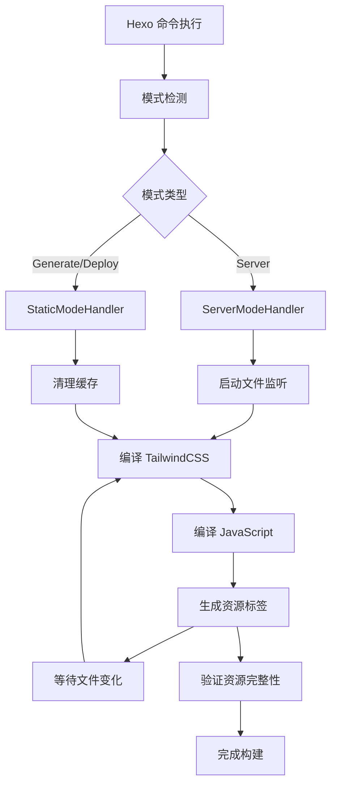

# 🦢 Hexo Goose Builder

> 🚀 **现代化的 Hexo 主题构建工具**  
> 为 Hexo 博客提供完整的现代前端工程化解决方案，支持组件化开发、自动化构建和智能模式切换。

[](https://www.npmjs.com/package/hexo-goose-builder)
[](https://github.com/Travisun/hexo-goose-builder/blob/main/LICENSE)
[](https://nodejs.org)

## ✨ 特色功能

### 🏗️ 现代化构建体验
- **🎯 智能模式切换** - 自动识别 Hexo 执行模式（server/generate/deploy），提供针对性优化
- **📦 开箱即用** - 零配置启动，支持 TailwindCSS 和现代 JavaScript 构建
- **🔄 热重载开发** - 文件变化实时编译，开发体验丝滑流畅
- **⚡ 增量编译** - 智能缓存管理，避免重复构建

### 🎨 完整的前端工程化
- **🌈 TailwindCSS 集成** - 原生支持 TailwindCSS 编译和优化
- **📱 组件化开发** - 支持 JavaScript 组件模块化开发和自动打包
- **🏷️ 智能资源注入** - 自动生成资源标签，版本控制和缓存管理
- **🛡️ 类型安全** - 支持现代 ESM 模块和 TypeScript

### 🚀 生产级优化
- **📊 构建分析** - 详细的编译日志和性能分析
- **🧹 自动清理** - 智能缓存清理和资源管理
- **✅ 严格验证** - 部署前资源完整性检查
- **🔍 错误诊断** - 完善的错误处理和问题诊断

## 🎯 解决什么问题？

### 传统 Hexo 主题开发痛点
- ❌ 缺乏现代前端工程化工具支持
- ❌ 手动管理 CSS 和 JavaScript 资源
- ❌ 没有文件变化监听和热重载
- ❌ 缺乏组件化开发能力
- ❌ 部署时容易出现资源缺失问题

### 本插件提供的解决方案
- ✅ **一站式前端工程化** - 集成 TailwindCSS、JavaScript 打包、热重载
- ✅ **智能模式适配** - 根据不同使用场景自动调整构建策略
- ✅ **零配置体验** - 安装即用，无需复杂配置
- ✅ **生产级稳定性** - 完善的错误处理和资源验证机制

## 📦 快速开始

### 安装

```bash
# 使用 npm
npm install hexo-goose-builder --save

# 使用 yarn
yarn add hexo-goose-builder
```

### 基础使用

1. **在主题模板中加载资源**：
```ejs
<!-- 在 layout.ejs 的 <head> 标签中添加 -->
<%- load_theme_assets() %>
```

2. **开发模式启动**：
```bash
hexo server
```
插件会自动：
- 编译 TailwindCSS 样式
- 打包 JavaScript 组件  
- 启动文件监听和热重载

3. **生产构建**：
```bash
hexo generate
# 或
hexo deploy
```
插件会自动：
- 进行完整的资源编译
- 验证资源完整性
- 清理过期缓存

## 🏗️ 架构设计

### 模块化架构

```
hexo-goose-builder/
├── index.js                    # 🎯 核心控制器
├── lib/
│   ├── mode-factory.js        # 🏭 模式工厂
│   ├── server-mode-handler.js # 🔧 开发模式处理器
│   ├── static-mode-handler.js # 📦 生产模式处理器
│   ├── tailwind-compiler.js   # 🎨 TailwindCSS 编译器
│   ├── js-bundler.js          # 📱 JavaScript 打包器
│   ├── banner.js              # 🎪 状态展示
│   ├── progress-logger.js     # 📊 进度日志
│   └── utils.js               # 🛠️ 工具函数
└── templates/                  # 📋 配置模板
```

### 智能模式系统

插件采用**模式工厂模式**，根据 Hexo 命令自动创建对应的处理器：

#### 🔧 开发模式 (Server Mode)
```bash
hexo server  # 或 hexo s
```

**特性矩阵：**
- ✅ **文件监听** - 实时监控源文件变化
- ✅ **异步编译** - 不阻塞主服务进程
- ✅ **热重载** - 自动刷新编译结果
- ✅ **防抖优化** - 避免频繁重复编译
- ❌ 强制验证（性能优先）

#### 📦 生产模式 (Generate/Deploy Mode)
```bash
hexo generate  # 或 hexo g
hexo deploy    # 或 hexo d
```

**特性矩阵：**
- ✅ **强制编译** - 确保所有资源最新
- ✅ **严格验证** - 完整性和正确性检查
- ✅ **缓存清理** - 移除过期文件
- ✅ **错误阻断** - 发现问题立即停止
- ❌ 文件监听（不需要）

## 🔄 工作流程

### 标准编译流程



### 资源处理链

1. **🎨 样式处理**
   ```
   TailwindCSS 源文件 → PostCSS 处理 → 压缩优化 → 版本哈希 → 输出文件
   ```

2. **📱 脚本处理**
   ```
   JS 组件源文件 → Rollup 打包 → Babel 转译 → 代码分割 → 版本哈希 → 输出文件
   ```

3. **🏷️ 标签生成**
   ```html
   <!-- 自动生成的资源引用 -->
   <link rel="stylesheet" href="/css/components.styles.12345678.css">
   <script type="module" src="/js/components.AbCdEf123.bundle.js"></script>
   ```

## ⚙️ 配置选项

### 主配置 (`_config.yml`)

```yaml
# Hexo 站点配置
theme_builder:
  debug: false          # 开启调试模式
  # JavaScript 配置  
  javascript:
    minify: true         # 启用代码压缩
    protected: true     # 启用防止用户浏览器调试
  # 文件监听配置
  watch:
    patterns:
      - "source/**/*.js"
      - "layout/**/*.ejs"
      - "source/**/*.css"
    ignored:
      - "**/node_modules/**"
      - "**/.*"
  
```

## 🎨 样式开发

### TailwindCSS 集成

插件原生支持 TailwindCSS，提供完整的开发到生产流程，你可以通过Hexo根目录的`tailwind.config.js` 来配置自定义主题和样式。

### 组件样式

支持在模板中直接使用 TailwindCSS 样式类：

```ejs
<!-- layout/post.ejs -->
<article class="max-w-4xl mx-auto bg-white rounded-lg shadow-lg p-6">
  <h1 class="text-3xl font-bold text-gray-900 mb-4">
    <%= post.title %>
  </h1>
  <div class="prose prose-lg text-gray-700">
    <%- post.content %>
  </div>
</article>
```

## 📱 脚本开发

### 组件化结构

```javascript
// layout/components/gallery/gallery.js
export class Gallery {
  constructor(element) {
    this.element = element;
    this.init();
  }
  
  init() {
    // 组件初始化逻辑
    this.bindEvents();
  }
  
  bindEvents() {
    // 事件绑定
  }
}

// 自动注册组件
document.addEventListener('DOMContentLoaded', () => {
  document.querySelectorAll('.gallery').forEach(el => {
    new Gallery(el);
  });
});
```
## 🔍 调试与监控

### 调试模式

启用调试模式查看详细日志：

```yaml
# _config.yml
theme_builder:
  debug: true
```

调试输出示例：
```bash
[Theme Builder] 检测到server模式，重置编译状态...
[Server Mode] 初始化server模式处理器...
[Server Mode] 启动文件监听器...
[Theme Builder] 开始编译主题资源（server模式）...
[Theme Builder] ✓ TailwindCSS编译完成（server模式）
[Theme Builder] ✓ JS组件打包完成（server模式）
[Server Mode] 文件监听器已就绪，等待文件变化...
```

### 性能监控

插件提供详细的性能指标：

```bash
[Theme Builder] 编译统计:
  - TailwindCSS: 245ms
  - JavaScript: 156ms  
  - 总耗时: 401ms
  - 输出文件: 3 个
  - 文件大小: 127KB
```

## 📊 最佳实践

### 🚀 性能优化

1. **合理使用 TailwindCSS**
   ```css
   /* ✅ 推荐：使用实用类 */
   .btn { @apply px-4 py-2 bg-blue-500 text-white rounded; }
   
   /* ❌ 避免：过度自定义 */
   .btn { background: linear-gradient(45deg, #1e3a8a, #3b82f6); }
   ```

2. **模块化组件开发**
   ```javascript
   // ✅ 推荐：按功能分离
   components/
   ├── navigation/
   │   ├── navigation.js
   │   └── navigation.css
   ├── gallery/
   │   ├── gallery.js
   │   └── gallery.css
   └── theme-toggle/
       ├── theme-toggle.js
       └── theme-toggle.css
   ```

### 🛡️ 集成到主题
主需要在你的Hexo现有主题的 html head 标签内引入下列助手代码，Goose Builder 会在生成页面时自动完成依赖注入：
```ejs
<%- load_theme_assets() %>
```

## 🔧 故障排除

### 常见问题

#### Q: 样式没有生效？
**A: 检查以下几点：**
1. 确认 TailwindCSS 编译成功
2. 检查模板中是否正确调用 `<%- load_theme_assets() %>`
3. 验证 CSS 文件是否正确生成到 `source/css/` 目录

#### Q: JavaScript 组件无法加载？
**A: 排查步骤：**
1. 打开浏览器控制台查看错误信息
2. 确认 JS 文件路径正确
3. 检查是否有语法错误阻止执行

#### Q: 开发模式下文件变化不触发重编译？
**A: 可能原因：**
1. 文件不在监听路径内
2. 权限问题阻止文件访问
3. 防抖时间内的重复变化被忽略

#### Q: 部署后网站样式丢失？
**A: 解决方案：**
1. 检查部署前是否看到编译成功日志
2. 确认静态资源是否正确上传
3. 检查 CDN 或服务器缓存设置

### 获取帮助

- 🐛 **问题反馈**: [GitHub Issues](https://github.com/Travisun/hexo-goose-builder/issues)
- 📖 **文档**: [项目文档](https://github.com/Travisun/hexo-goose-builder#readme)
- 💬 **讨论**: [GitHub Discussions](https://github.com/Travisun/hexo-goose-builder/discussions)

## 🤝 贡献指南

欢迎朋友们贡献代码和建议！

### 开发环境
将此插件安装为本地npm依赖，安装到你的本地 hexo 环境以供加载：
```bash
# 克隆项目
git clone https://github.com/Travisun/hexo-goose-builder.git
cd your-local-hexo-root
# 通过本地安装依赖
npm i {path_to_hexo-goose-builder}

# 运行测试(查看是否出现Builder欢迎信息)
hexo server
```

### 提交要求

1. **代码风格**: 遵循 ESLint 规则
2. **测试**: 确保现有测试通过
3. **文档**: 更新相关文档
4. **提交信息**: 使用语义化提交格式

## 📋 更新日志

### v1.0.0 (最新)
- ✨ 重构为模块化架构
- 🚀 新增完整的 Deploy 模式支持
- 🔄 优化文件监听和热重载机制
- 🛡️ 增强错误处理和资源验证
- 📊 改进日志输出和状态展示

### 未来规划
- 🎯 支持更多前端框架集成 (Vue、React)
- 📱 移动端优化和 PWA 支持
- 🌐 国际化 (i18n) 支持
- 🔌 插件生态系统

## 📄 许可证

[MIT License](LICENSE) © 2025 [Travis Tang](https://github.com/Travisun)

<div align="center" style="background-color: #f0f0f0;padding: 10px;border-radius: 5px;">

**⭐ 如果这个项目对你有帮助，请给一个 Star！**

[🏠 首页](https://github.com/Travisun/hexo-goose-builder) • 
[📚 文档](https://github.com/Travisun/hexo-goose-builder#readme) • 
[🐛 问题](https://github.com/Travisun/hexo-goose-builder/issues) • 
[💬 讨论](https://github.com/Travisun/hexo-goose-builder/discussions)

</div> 